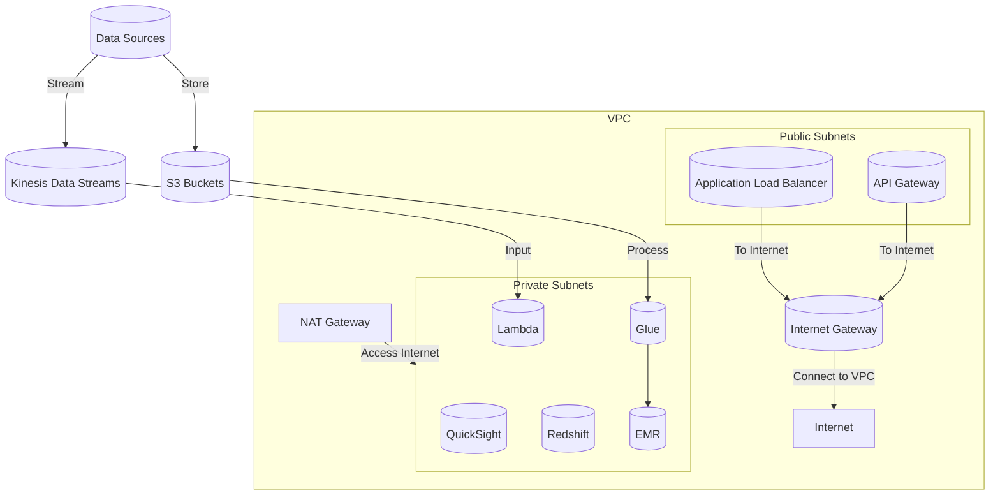
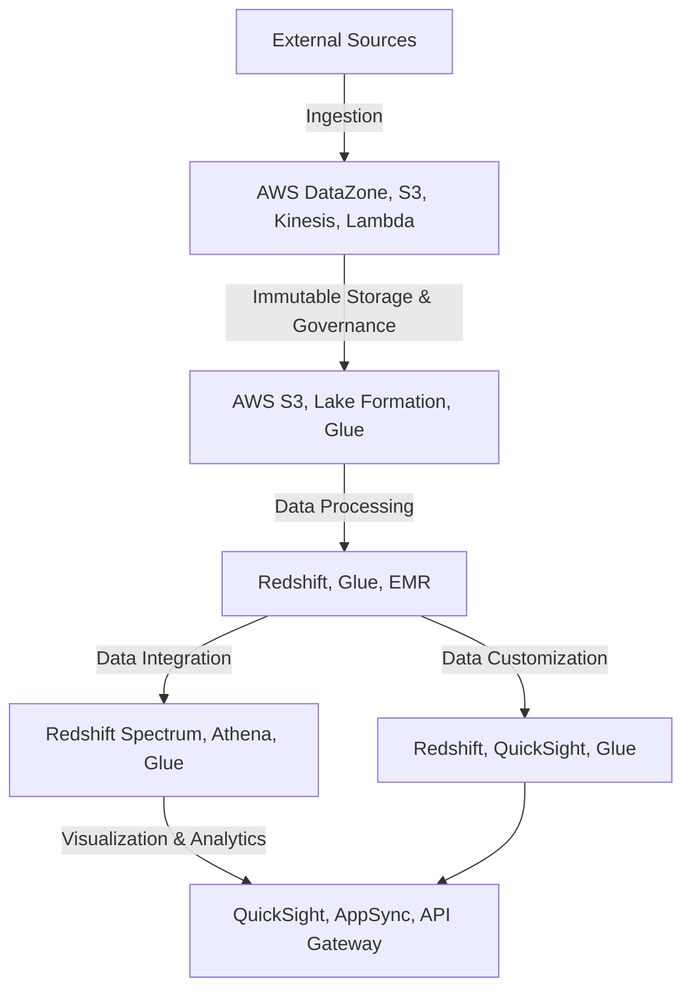

## Reference Architecture on AWS for The Medallion Architecture

The Medallion Architecture can be effectively implemented on AWS, utilizing its comprehensive suite of services to cater to each layer of the architecture. This section outlines a detailed AWS-based reference architecture for Medallion.

### Networking

- Utilize a VPC with public and private subnets to securely host AWS services
- Public subnets for internet-facing services like API Gateway and Application Load Balancer
- Private subnets for backend services like Redshift, EMR, Glue etc.
- NAT Gateway enables private subnets to access internet for software updates etc.
- Kinesis Data Streams and S3 receive data from sources
- All data transfer between services secured using VPC Endpoints

### Landing Zone

- **AWS Services**: Amazon S3, AWS Glue, AWS Lambda, Amazon Kinesis Data Streams, AWS Data Exchange
- **Purpose**: Ingestion and initial processing of data from various sources.
- **Implementation**: Utilize Amazon S3 for highly durable object storage, AWS Glue for serverless ETL and data catalog, AWS Lambda for serverless computing on streaming/batched data, Amazon Kinesis Data Streams for real-time streaming, and AWS Data Exchange for data sharing.

### Initial Layer

- **AWS Services**: Amazon S3, AWS Lake Formation, AWS Glue
- **Purpose**: Immutable storage of raw data with comprehensive governance and auditing.
- **Implementation**: Store raw data in Amazon S3 using versioning for immutable storage. Apply AWS Lake Formation for security, access control, governance. Use AWS Glue for cataloging, transformations and boundary setting by controlling data flow.

### Intermediate Layer

- **AWS Services**: Amazon Redshift, AWS Glue, Amazon EMR
- **Purpose**: Complex transformation, normalization, aggregation and analysis as datamarts and analytical datasets.
- **Implementation**: Leverage Amazon Redshift for OLAP workloads, joining datasets, aggregation. AWS Glue for handling variety of data sources, transformations, data catalog and job orchestration. Amazon EMR for processing huge volumes of data across clusters.

### Integrated Layer

- **AWS Services**: Amazon Redshift Spectrum, AWS Glue, Amazon Athena, AWS Lake Formation
- **Purpose**: Federation and integration of siloed data across various engines into analytical datasets. Governance of lakehouse architecture.
- **Implementation**: Amazon Redshift Spectrum to query exabytes of unstructured data in S3. AWS Glue crawler to catalog data. Athena for direct SQL access. Lake Formation for security and governance.

### Refined Layer

- **AWS Services**: Amazon Redshift, Amazon QuickSight, AWS Glue
- **Purpose**: Customization and preparation of data for consumption by specific personas and use cases.
- **Implementation**: Utilize Amazon Redshift for final data transformations based on user needs. QuickSight for customizable visualizations for business insights tailored to user requirements. AWS Glue for any final transformations.

### End-Use Applications

- **AWS Services**: Amazon QuickSight, AWS AppSync, Amazon API Gateway
- **Purpose**: Delivering processed data to applications and end-users.
- **Implementation**: QuickSight dashboards and reports for interactive analytics. AWS AppSync to build scalable data driven apps with real-time data sync. Amazon API Gateway for creating robust, scalable and secure APIs for public consumption.

### Overall Architecture Diagram

This enhanced AWS reference architecture provides additional details around networking, ensures secure transfer of data between various services through VPC endpoints, brings in additional services like Kinesis Data Streams, EMR, Redshift Spectrum, Athena, AppSync and Data Exchange to strengthen the implementation across layers of the architecture.
