# The Medallion Architecture

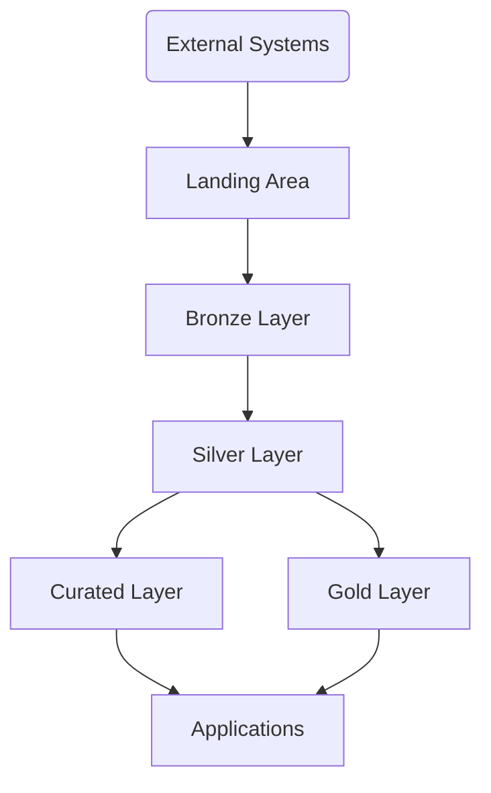

## Introduction

Data infrastructure has evolved from running Spark workloads on Kubernetes to leveraging services like Amazon EMR and traditional BI tools for analytics. However, this piecemeal approach has created fragmented data silos. Seeks to build a unified Lakehouse architecture using Medallion that can bring together the best capabilities across these environments.

The Medallion blueprint provides a way to orchestrate and manage data pipelines from raw data processed in Spark on EMR, to curated datasets accessed from BI tools like Tableau for reporting. Medallion establishes common data models, schema management, governance and enables easier migration of analytics from Spark ML workloads to BI tools.

This whitepaper covers how Medallion's layered architecture can help transition from current generation big data tools to a next-generation Lakehouse. We detail considerations around metadata management, security, pipeline orchestration and compatibility across Spark, EMR and BI tools like Tableau. The Medallion architecture will provide a modern and flexible data analytics platform to meet emerging business needs.

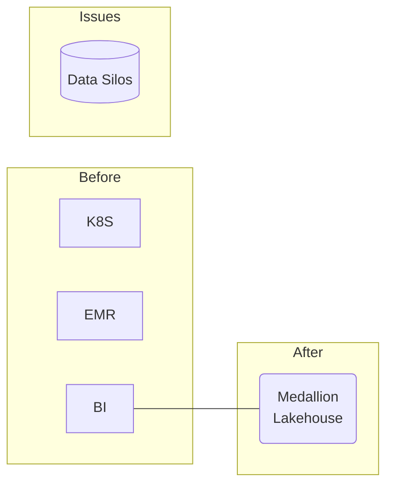

## Mapping to Traditional Data Processing Layers

The Medallion architecture consists of layers that correspond to traditional data processing needs:

- Landing Area: Raw data ingestion
- Bronze Layer: Immutable raw data
- Silver Layer: Cleansed and validated data
- Curated Layer: Authoritative shared data assets
- Gold Layer: Tailored integrated data
- Gold/Curated: Aggregated data products

This demonstrates how Medallion maps to common data engineering steps in a modular fashion. Next we dive deeper into the capabilities of each layer.

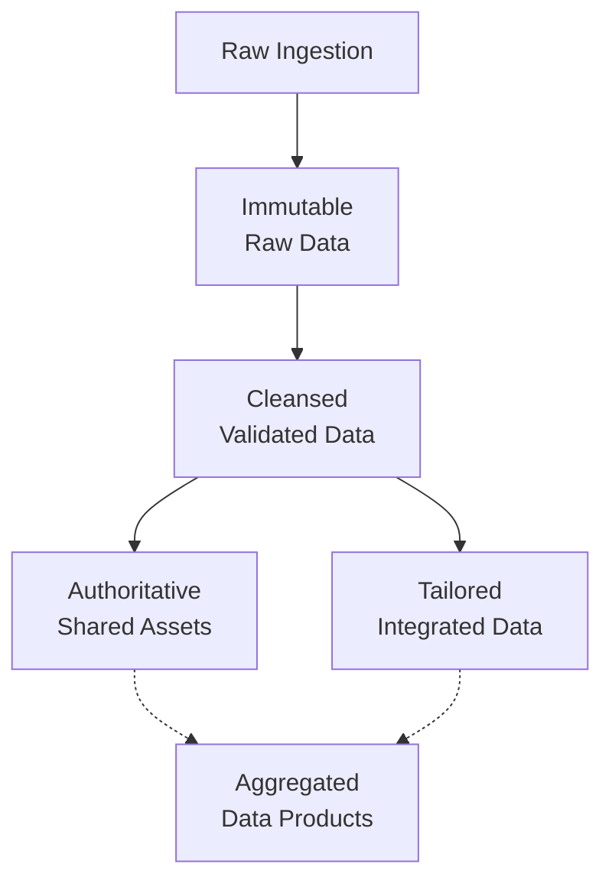

## Layers of the Medallion Architecture

The below diagram illustrates how data flows through the layers of the Medallion architecture. It starts with data ingestion from external systems into a Landing Area, which acts as a staging layer.

Raw data is then loaded into the Bronze layer, which serves as an immutable store of the data exactly as it was received. The Silver layer refines the raw data into curated and validated datasets. The Curated layer combines data from Silver into authoritative shared data assets.

The Gold layer prepares tailored datasets for specific use cases and applications. Both the Curated and Gold layers provide integrated, high quality data products to downstream applications and analytics workloads.

This layered data pipeline enables decoupling of the raw data ingestion from the refined datasets that get served to consumers. It also allows reuse of common data across the organization via the Curated layer, while still enabling custom views in Gold for particular use cases. The architecture supports good data governance through its use of progressively refined and integrated data sets.

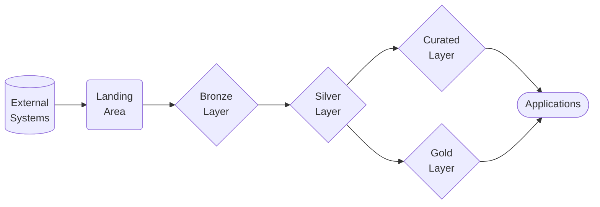

### Landing Area

The Landing Area provides a flexible staging layer to ingest data from diverse sources like databases, files, streams, IoT devices, and more. Data is consolidated here in its true raw format before transformation. This area serves as a buffer and collection point for data before loading into the Bronze layer. Key features include:

- Schema-on-read approach - store data in original schema
- Native formats - CSV, JSON, parquet, AVRO, etc.
- Batch or streaming ingestion
- Integration layer for diverse data
- Optional data quarantine for validation
- Transient storage before Bronze

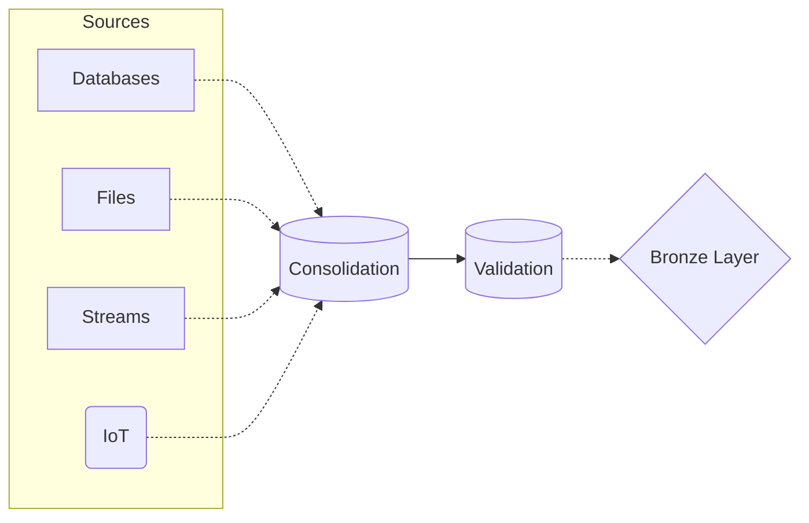

### Bronze Layer

The Bronze layer acts as the immutable store for raw data across the organization. It retains full history and provides a single source of truth. Key aspects include:

- Immutable storage of raw data as-is
- Full auditable history with timestamping
- Schema changes automatically tracked
- Partitioning organized by ingestion time
- No transformation or business logic
- Data parsing/validation for downstream processing
- Store in performant formats like Parquet

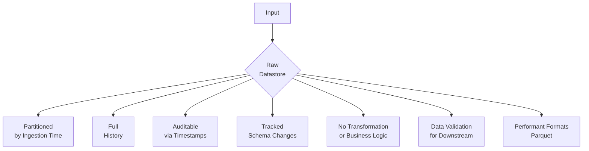

### Silver Layer

The Silver layer refines raw data from Bronze into curated, high-quality datasets for downstream analytics and operations. It prepares shareable, trusted data products. Capabilities include:

- Data cleansing, validation, and filtering
- Data modeling with domains and semantics
- Type 2 historization for temporal tracking
- Master data management and conformed dimensions
- Data enrichment and reference data joins
- Materialized derived datasets, aggregates, and cubes
- Business metadata and glossary

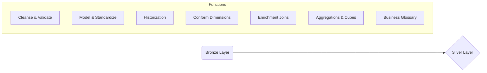

### Curated Layer

The Curated layer combines integrated data from Silver along with external sources into well-governed data products for broad enterprise consumption. Key functionalities:

- Blends multiple Silver data sources
- Certification and trust indicators on data
- Managing data access and usage policies
- Business glossary and definitions
- Common models, metrics, and KPIs
- Master data and reference data management
- Third-party and external data integration

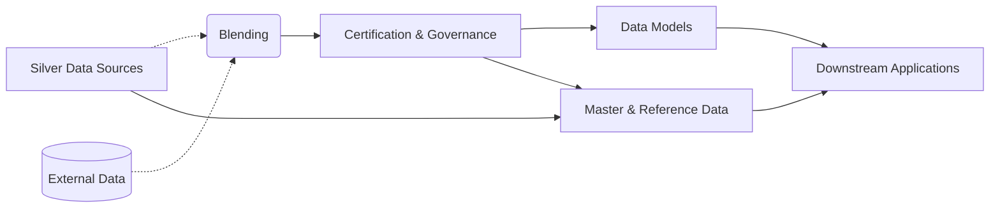

## Data Contracts

A key concern in building a coherent Lakehouse architecture is establishing trust and shared understanding between data producers and consumers. The Data Mesh paradigm advocates the use of "data contracts" to align capabilities and expectations.

Data contracts formalize the agreement between data teams on aspects like:

- Data schemas, models, formats
- Update frequencies, SLAs
- Data quality metrics, validations
- Business metadata and definitions
- Data governance policies

In the Medallion architecture, data contracts play an important role in bridging the Curated and Gold layers. The Curated zone acts as the source of truth and core data products. Data contracts allow this zone to provide self-service access to downstream consumers in Gold, while maintaining governed data assets.

For example, the customer data contract establishes the schema, semantics, SLAs, and access policies for customer data curated in the Curated layer. Any applications consuming this data through the Gold layer can onboard to this contract, relying on its consistency and quality guarantees.

Data contracts enable decoupling teams across the Lakehouse by aligning capabilities through well-defined technical and business agreements. This facilitates reuse, self-service access and agility across the organization.

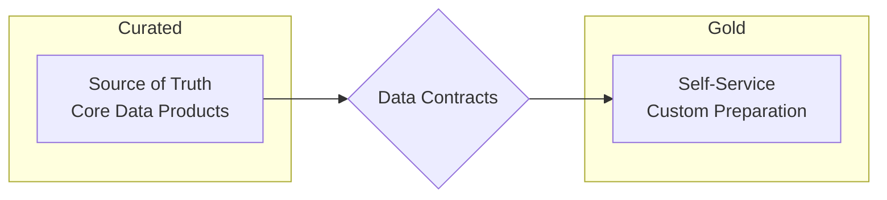

### Gold Layer

The Gold layer prepares tailored datasets for specific applications, users, and consumption use cases. It applies final transformations and business logic. Features include:

- Business user self-service preparation
- Data sandboxes for knowledge workers/analysts
- Data masking for PII protection
- Integration across siloed systems
- Aggregation, rollups, and hypercubes
- Caching for performance optimization
- Custom views and schemas for consumers
- Metadata-driven automation and reuse

| Medallion Layer | Technologies | Description |
|-|-|-|
| Landing Area | AWS S3 | S3 for landing raw data |  
| Bronze | Delta Lake on Databricks | Immutable raw data stored in Delta Lake |
| Silver | Spark SQL on Databricks | Data transformation using Spark SQL |
| Curated | Unity Catalog | Business glossary, lineage, governance |
| Gold | SQL Analytics on Databricks | Aggregates and dashboards for BI tools |

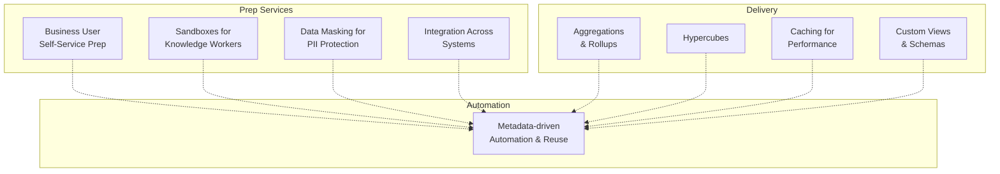

### Incremental data replication

- Autoloader for incremental data ingestion

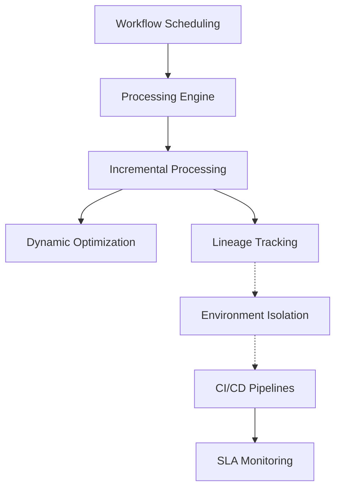

## Data Pipeline Orchestration

Moving data across the Medallion layers requires careful orchestration using workflow schedulers, distributed processing, and DevOps practices:

### Workflow Scheduling

- Tools like Apache Airflow/Brickflow to define and orchestrate pipelines
- Environmental isolation - dev, test, prod
- CI/CD principles applied to data
- SLA monitoring and alerting
- Lineage tracking across workflow steps

### Processing Engines

- Leveraging execution engines like Spark, Flink for distributed processing

### Incremental Processing

Delta Lake enables efficient incremental processing through change data capture and management of table snapshots. Key features include:

- **Change Data Capture** - Delta Lake uses transaction log to track record inserts, updates and deletes. This change set can be processed incrementally.
- **Upsert Updates** - The MERGE INTO syntax in Delta Lake allows atomically updating or inserting records based on a condition. This handles change data seamlessly.
- **Time Travel** - Table snapshots allow queries as of a point in time. Incremental jobs can access previous snapshot states.
- **Stream Processing** - Streaming data can be incrementally appended to Delta tables using streaming writes.
- **Automated Pipeline Updates** - Table schema changes trigger re-generation of incremental pipelines to adapt to updates.
- **Partition Management** - Time-based partitions can be used to limit incremental processing to new partitions.
- **Optimized Log Retention** - Old transaction log data can be automatically pruned to reduce storage overhead.
- **Job Idempotency** - Incremental jobs are idempotent and can be safely re-run on the same input data.

By leveraging these Delta Lake features, Databricks enables building efficient and fault-tolerant incremental ETL pipelines that maximize performance on growing data volumes. The unified batch and streaming processing model provides flexibility.

Pipeline Task | Databricks Offering | Description
-|-|-
Workflow Scheduling | Pipelines | Orchestrate end-to-end data pipelines and workflows
Processing Engine | Spark Cluster | Leverage scalable Spark processing for ETL data tasks  
Incremental Processing | Delta Lake | Delta Lake change data capture enables incremental ETL
Dynamic Optimization | Auto-scaling | Automatically scale Spark clusters to optimize processing  
Lineage Tracking | Unity Catalog | Unity Catalog captures lineage across pipelines
Environment Isolation | Workspaces | Workspaces provide dev, test, prod environment isolation  
CI/CD | CI/CD Pipelines | Deploy code changes through CI/CD pipelines
SLA Monitoring | Job Monitoring | Monitor job metrics and SLAs on pipeline runs  

- **Workflow Scheduling**: Pipelines provide workflow scheduling and orchestration capabilities to build and manage data pipelines.
- **Processing Engine**: Spark clusters supply distributed data processing engine leveraging DataFrame/Dataset APIs.
- **Incremental Processing**: Delta Lake change data capture powers incremental ETL processing.
- **Dynamic Optimization**: Auto-scaling feature automatically scales clusters up/down to meet processing demands.
- **Lineage Tracking**: Unity Catalog captures metadata and lineage information across pipelines.
- **Environment Isolation**: Workspaces allow creating isolated environments for dev, test, production.
- **CI/CD**: CI/CD pipelines enable continuous integration and deployment of code changes.
- **SLA Monitoring**: Advanced job monitoring provides insights into job metrics, SLAs and pipeline health.

This demonstrates how Medallion can enable varied analytics use cases with data to drive business insights.
## Schema Management

Managing schemas for analytical datasets requires careful consideration as source data schemas evolve. Delta Lake provides several key capabilities:

- **Schema Evolution** - Delta Lake allows schema changes via DDL alter table commands. New columns can be directly added.
- **Schema on Read** - Queries can project only required columns ignoring schema changes. New data gets automatically serialized.
- **Column Metadata** - Column metadata like comment, description and data type is preserved even across schema changes.
- **Schema Enforcement** - Schema validation ensures compliance during dataframe writes to the Delta table.
- **Merge Schema** - Schemas can be merged during dataframe writes keeping common columns intact.
- **Time Travel** - Table snapshots allow reconstructing schema at any historical point in time.
- **Schema Drift Metrics** - Dasbhoards track schema differences across table versions to detect drift.
- **Schema Change Alerts** - Alerts can be configured to trigger based on the threshold of schema differences.
- **Multi-format Support** - Open formats like Parquet, JSON, AVRO provide schema flexibility and interoperability.

By leveraging Delta Lake, Databricks provides robust schema management capabilities like evolution, time-travel and drift detection that address key schema challenges in building a Lakehouse architecture.

With data from disparate sources, schema management is a key consideration for Medallion:

- **Schema Evolution**
    - Bronze holds immutable raw data as schema changes upstream
    - In the Bronze layer, Delta Lake tables store raw immutable data as-is without applying schema transformations. This ensures historical data is never changed even as upstream source schemas get updated. New columns added to sources will be automatically available in Bronze.

- **Type 2 tracking in Silver retains history of schema changes**
    - The Silver layer leverages Type 2 tracking in Delta Lake to manage schema changes with time travel. Altering Silver table schema adds new columns with metadata while retaining historical data intact. Queries can reconstruct schema at any historical point.

- **Gold can reconstruct schemas and views on read**
    - In the Gold layer, schemas can be evolved by directly altering tables. But downstream views and aggregations designed for specific consumers can reconstruct required schema on read by projecting only essential columns. This prevents changes in Gold schemas from affecting downstream usage.

- **Metadata management tracks schema changes across pipelines**
    - Unity Catalog captures metadata like table schemas, columns and data types as they evolve across Bronze, Silver and Gold. Data discovery, lineage and impact analysis can leverage this metadata to understand schema changes across layers.

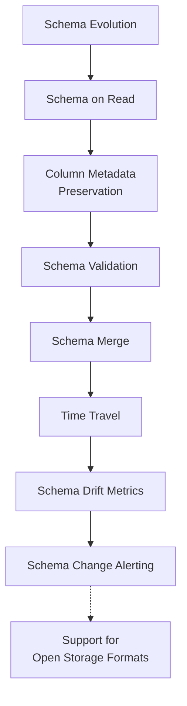

## Historization

Type 2 uses start/end dating within same table  
Delta Lake supports Type 2 historization using time travel capabilities. Records can have start and end timestamp columns added. New inserts/updates get new time ranges, while old rows remain intact allowing time-series analysis.

Type 4 splits current and historical data into separate tables  
For Type 4 historization, current data can stay in the main Delta table. Historical snapshots can be written to separate 'history' tables using DataFrame APIs at batch intervals.

Optimized based on data volume, query patterns  
Type 2 avoids major size increases but may impact main table performance. Type 4 reduces current table size but incurs join costs for historical analysis. Choice can be optimized based on data volumes, query patterns and cost.

Retain full audit trail of changes  
Delta Lake transaction log and time travel provides a full audit history of all changes. Historical snapshots also capture the table state at a point in time. This provides a complete audit trail under both models.

Delta Lake thus provides flexibility to implement both Type 2 and Type 4 historization models, while retaining transaction history and ability to time travel. The Lakehouse architecture can leverage the optimal approach based on the dataset and use case.

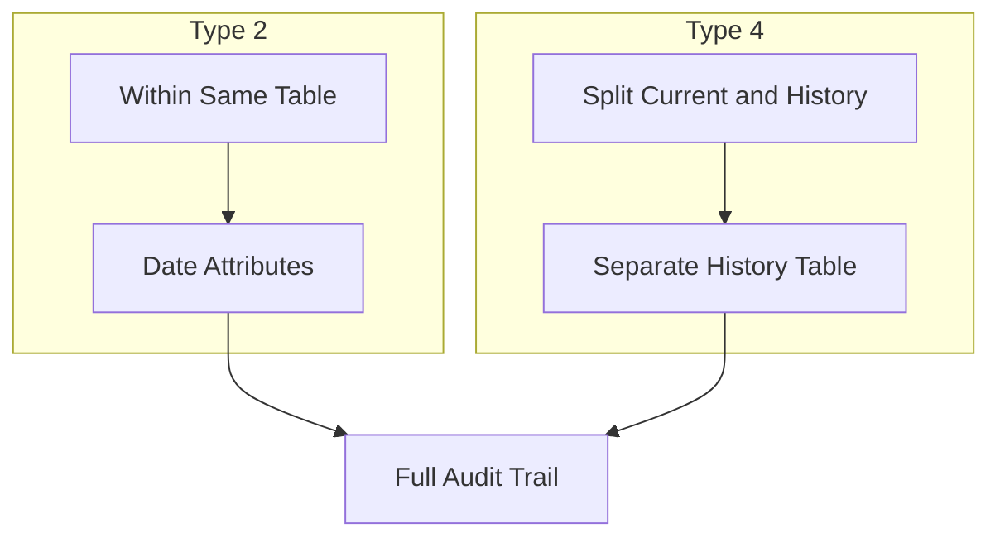

## Normalization

- **Silver serves as the normalization layer, conformed dimensions**
    - The Silver layer in Delta Lake is ideal for normalization since it curates the authoritative data. Normalized entities like customers, products, inventory can be built here with properly conformed dimensions.

- **Gold can denormalize into schema specific for downstream usage**
    - While Silver maintains normalized data, the Gold layer can reshape data into denormalized models best suited for different consumer needs. This avoids joins and provides query-optimized schema.

- **Multi-model support - relational, graph, doc, columnar**
    - Delta Lake provides kernels for relational, graph and document data models. This allows leveraging the right structure based on access patterns. Columnar storage optimizes analytic workloads.

  For example, user profiles in Silver may be in relational normalized form. In Gold, a graph model can capture profile-product affinity for recommendations, while a columnar format speeds up analytics.

  By leveraging Delta Lake's multi-model capabilities, the Lakehouse can harmonize analytics using the optimal data model per downstream use case while maintaining normalized Silver datasets.

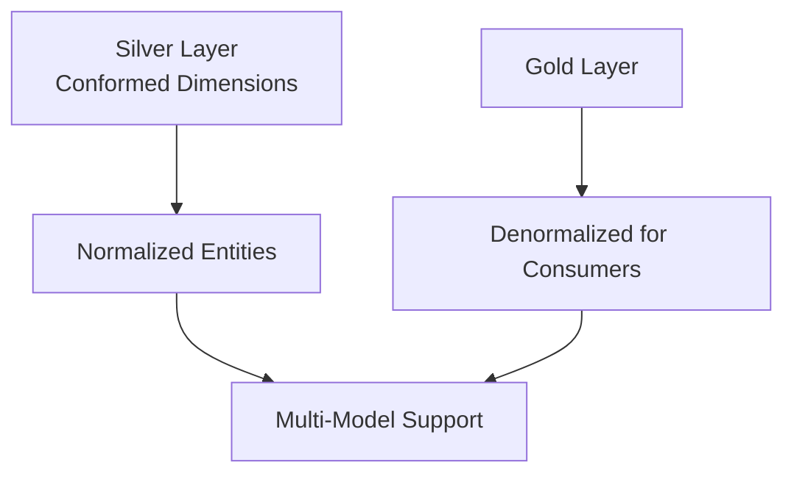

## Multi-Model Support

Delta Lake supports multiple data models and storage formats to fit various performance and analysis needs:

- **Relational Model** - Delta Lake supports traditional relational constructs like tables, foreign keys, and SQL for analysis. Normalized data can be stored relationally.
- **Graph Model** - Delta Lake integrates with graph frameworks like GraphFrames to store connected data and run graph algorithms. This is useful for recommendations, network analysis, etc.
- **Document Model** - Delta Lake can natively store semi-structured JSON data, useful for clickstream, IoT and other schema-less data.
- **Columnar Storage** - Data is stored columnarly in Parquet format for query optimization. This speeds up large analytic queries.

The Lakehouse leverages this flexibility to optimize storage and access patterns:

- Silver may use a relational model for easy normalization.
- Gold can denormalize into a graph or document structure matching downstream needs.
- Bronze and Silver use columnar formats like Parquet for query efficiency.
- New data sources like IoT events can be ingested in JSON document model.

This multi-model support allows tailoring data management to the specific use case while maintaining compatibility through the unified Delta Lake format. It provides flexibility within a consistent data lake.

## Historization Approaches

A key aspect of managing data evolution and history in Medallion is the historization approach. There are two main techniques:

### Type 2 Historization

Type 2 historization stores historical data within the same table by adding additional attributes to track changes over time. This approach is optimal when:

- There is a low to medium volume of historical data
- The main query patterns involve analyzing historical trends and time-series data
- Main table size can be managed without splitting history

For example, an "orders" table could add attributes like "effective_start_date" and "effective_end_date" to enable querying orders for a point in time. New and updated rows will get new date ranges, while old rows remain intact.

### Type 4 Historization

Type 4 historization stores current and historical data in separate tables, by creating a dedicated history table snapshot for archival. This approach is better when:

- There is a high volume of historical data
- Query patterns mainly access current data
- Isolating history reduces table sizes for better performance

In this case, the "orders" table would retain only current orders. A separate "orders_history" table would store snapshots of past orders. The pipeline managing historization would insert new snapshots into orders_history during update batches.

The choice between Type 2 and Type 4 depends on the data volume, query patterns, and complexity of reconstruction. Both approaches allow reproducing past states of data through date-based filtering or joins. Medallion's layered architecture accommodates the right historization model for each dataset's needs.

## Metadata Management

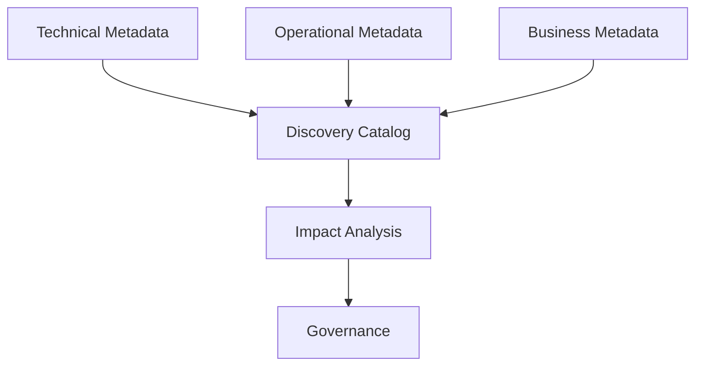

Robust metadata management is critical for data discovery, governance and lineage. Key capabilities provided:

### Technical Metadata

- Dataset and attribute definitions
- Unity Catalog captures table and column level metadata including names, descriptions, comments. Columns have defined data types, precision, scale, nullable status etc. Primary/foreign keys, indices are tracked.
- Data types, formats, schemas
- Table and column storage formats (Parquet, ORC, JSON) and serialization schemas are captured by Unity Catalog and stored as Delta Lake properties.
- Master data