# The Medallion Architecture

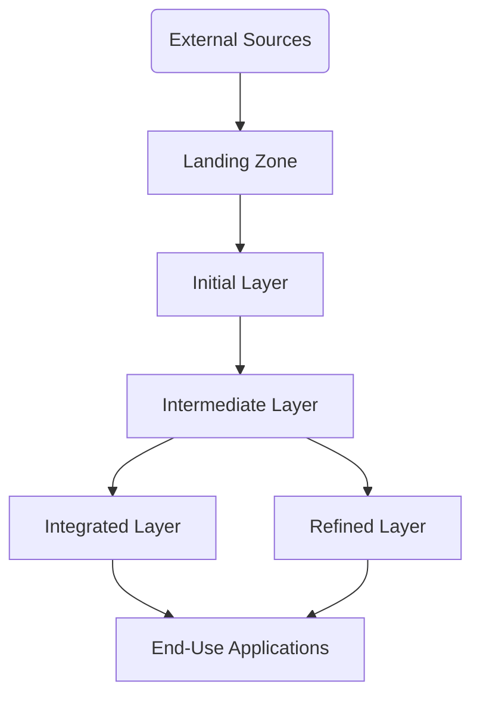

> NOTE: After reading this paper do read specific reference architecture:
> 
> [Medallion Reference Architecture on AWS](aws_reference_architecture.md)
> 
> [Medallion Reference Architecture on AWS and Databricks](reference_architecture_aws_databricks.md)
> 
>    - [Reference implementation](reference_implementation.md)

## Introduction

Contemporary data environments have transitioned from monolithic systems to diversified solutions like cloud services and specialized analytics tools. This diversity, while powerful, often leads to disjointed data ecosystems. The Medallion framework seeks to consolidate these disparate elements into a cohesive Lakehouse architecture, harmonizing various capabilities from raw data processing to sophisticated analytics.

Medallion outlines a method for structuring and managing data pipelines, encompassing everything from raw data handling in cloud environments to refined data utilization in analytics platforms. It emphasizes uniform data structures, efficient schema management, robust governance, and facilitates the transition of analytics workflows from raw data processing to advanced BI tools.

This white paper delves into the layered structure of the Medallion architecture, highlighting its role in transforming modern big data tools into a comprehensive Lakehouse system. We discuss key aspects like metadata management, security, pipeline coordination, and compatibility with various technologies including cloud data services and BI platforms. Medallion represents a progressive, adaptable solution for contemporary data analytics challenges.

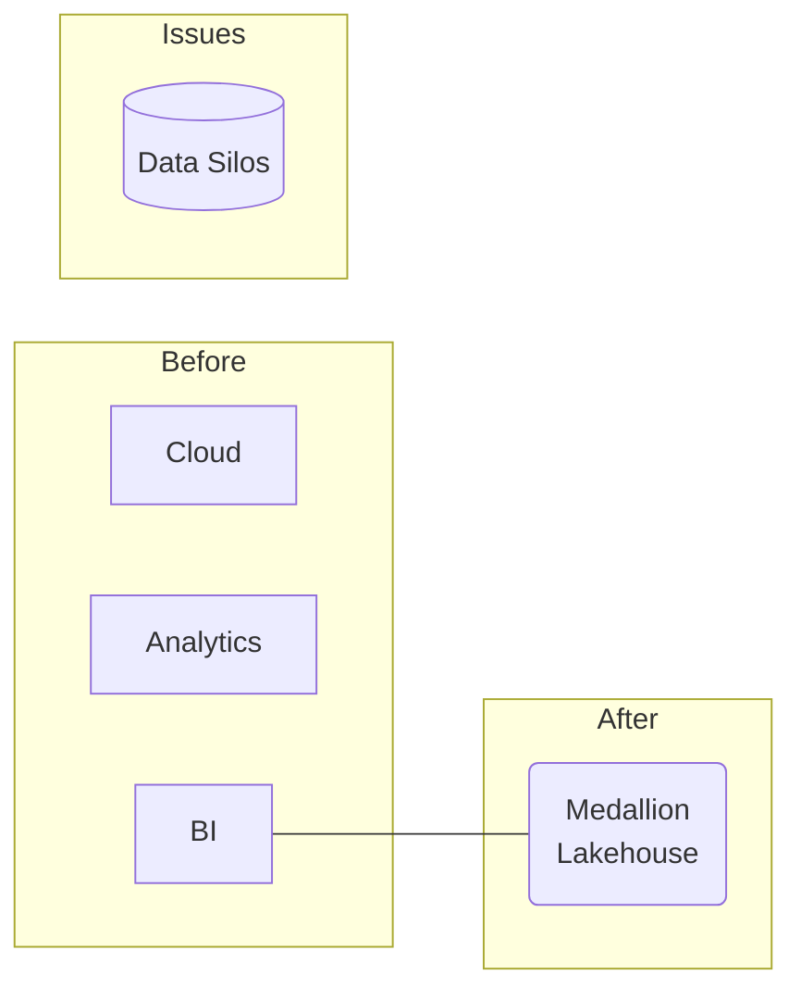

## Mapping to Generic Data Processing Layers

The Medallion architecture is composed of distinct layers, each correlating to conventional data processing stages:

- Landing Zone: Primary data collection
- Initial Layer: Immutable primary data storage
- Intermediate Layer: Data cleansing and standardization
- Integrated Layer: Consolidation of standardized data
- Refined Layer: Customized data integration
- Integrated/Refined: Combined data solutions

These layers demonstrate how Medallion modularly aligns with standard data engineering processes. Next, we explore the functionality of each layer.

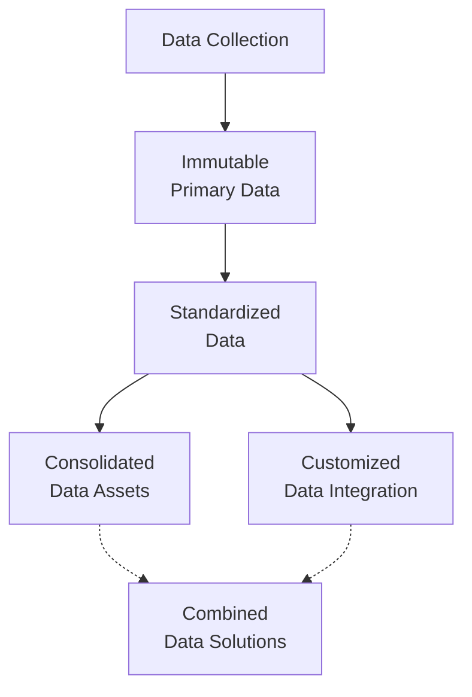


## Layers of the Medallion Architecture

The following diagram illustrates the data flow through Medallion's layers, starting with the ingestion of external data into the Landing Zone, serving as the initial data staging area.

Raw data is loaded into the Initial layer, maintaining an unaltered record of received data. The Intermediate layer processes this raw data into cleansed and standardized datasets. The Integrated layer then amalgamates data from the Intermediate layer into consolidated data assets.

The Refined layer tailors datasets for specific applications and use cases. Both Integrated and Refined layers supply high-quality data solutions to downstream applications and analytics workflows.

This layered pipeline allows for separation of raw data collection from the refined data provided to end-users. It promotes the reuse of standardized data across the organization through the Integrated layer, while the Refined layer offers tailored solutions for specific needs. The architecture supports effective data governance with progressively refined and integrated datasets.

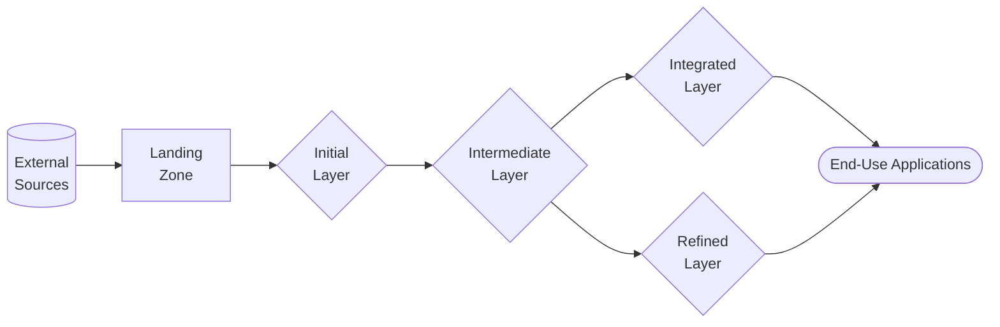

### Landing Zone

The Landing Zone is a versatile staging area designed for data ingestion from varied sources like databases, file systems, streaming platforms, IoT devices, and others. Here, data is gathered in its raw form prior to any transformation, serving as a preliminary collection and buffering stage before moving to the Initial layer. Key features include:

- Schema-on-read capability: retaining original data schema
- Support for various data formats: CSV, JSON, Parquet, AVRO, etc.
- Capabilities for both batch and streaming data ingestion
- Integration point for diverse data sources
- Optional data validation and quarantine processes
- Transitory storage before moving to the Initial layer

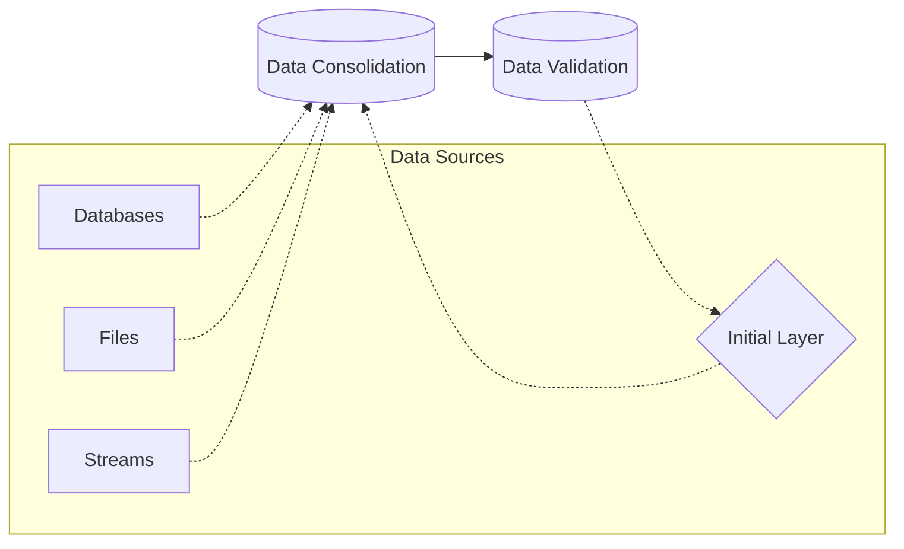

### Initial Layer

The Initial layer serves as the immutable repository for raw data within the organization, preserving a complete history and functioning as a single source of truth. Its main characteristics include:

- Immutable storage of raw data in its original form
- Comprehensive and auditable history with timestamping
- Automatic tracking of schema changes
- Organized partitioning by data ingestion time
- Absence of transformation or business logic
- Data parsing and validation for subsequent processing stages
- Efficient data storage formats like Parquet

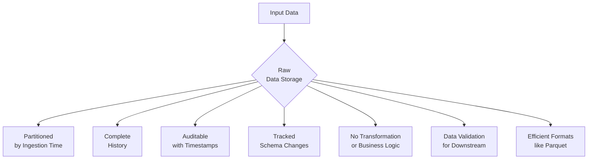

### Intermediate Layer

The Intermediate layer is where raw data from the Initial layer is refined into high-quality, shareable datasets for downstream analytics and operational purposes. This layer is responsible for:

- Data cleansing, validation, and filtering
- Establishing data models with clear domains and semantics
- Type 2 historization for temporal data tracking
- Management of master data and conformed dimensions
- Data enrichment through reference data joins
- Creation of materialized datasets, aggregates, and data cubes
- Development of a business metadata repository and glossary

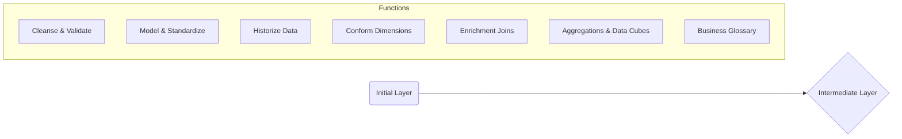

### Integrated Layer

The Integrated layer aggregates and refines the standardized data from the Intermediate layer, along with data from external sources, into well-governed and broadly accessible data products. Its primary functions include:

- Merging various data sources from the Intermediate layer
- Data certification and trust indicators
- Management of data access and utilization policies
- Establishment of a business glossary and clear definitions
- Creation of common data models, metrics, and KPIs
- Incorporation of master and reference data management
- Integration with third-party and external data sources

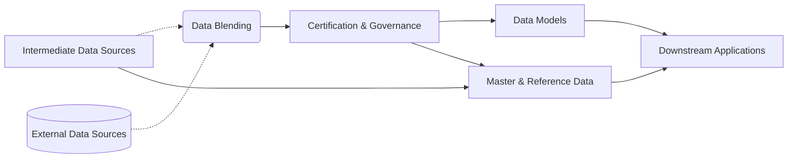

## Schema Management

Effective schema management is crucial for maintaining and utilizing analytical datasets, particularly as source data schemas evolve. Within the Medallion architecture, several strategies and tools are employed to handle schema management effectively:

- **Schema Evolution**: Allows for seamless modifications to the schema, such as adding new columns, using DDL alter table commands in Delta Lake.
- **Schema on Read**: Facilitates query execution even with evolving schemas by projecting only the required columns, ensuring new data fits within the existing schema.
- **Column Metadata**: Ensures that details like column descriptions, data types, and other metadata are maintained across schema changes.
- **Schema Enforcement**: Validates compliance with the predefined schema during data writes to Delta tables.
- **Merge Schema**: Permits the merging of schemas during data writes, maintaining the integrity of common columns.
- **Time Travel**: Provides the capability to reconstruct table schemas as of any historical point, offering insights into data evolution.
- **Schema Drift Metrics**: Tracks and visualizes schema differences over time to identify and manage schema drift.
- **Schema Change Alerts**: Configurable notifications for significant schema changes, aiding in proactive data management.
- **Multi-format Support**: Accommodates a variety of open storage formats like Parquet, JSON, and AVRO, ensuring schema flexibility and interoperability.

By leveraging these features, particularly within Delta Lake, the Medallion architecture provides robust schema management capabilities. This addresses key challenges associated with managing schemas in a Lakehouse architecture, facilitating data consistency and reliability across the data lifecycle.

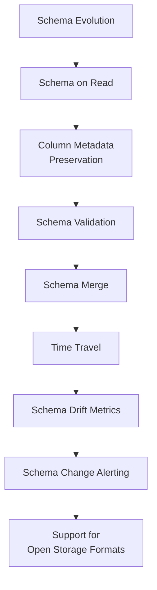

## Historization

Historization within the Medallion architecture refers to the strategies for managing historical data and its evolution over time. Key approaches include:

### Type 2 Historization

- Implemented using start and end dates within the same table.
- Delta Lake's time travel capabilities are utilized to manage start and end timestamps for records, enabling the analysis of data over time.
- New inserts and updates are timestamped accordingly, while historical data remains unaltered.

### Type 4 Historization

- Involves splitting current and historical data into separate tables.
- The current data resides in the main Delta table, while historical data snapshots are maintained in separate 'history' tables.
- This approach is optimized based on data volumes, query patterns, and performance considerations.

Both Type 2 and Type 4 historization methods are supported, allowing for a comprehensive audit trail of data changes and the ability to reproduce historical states of data. The choice of method depends on specific data requirements and use cases within the Lakehouse architecture.

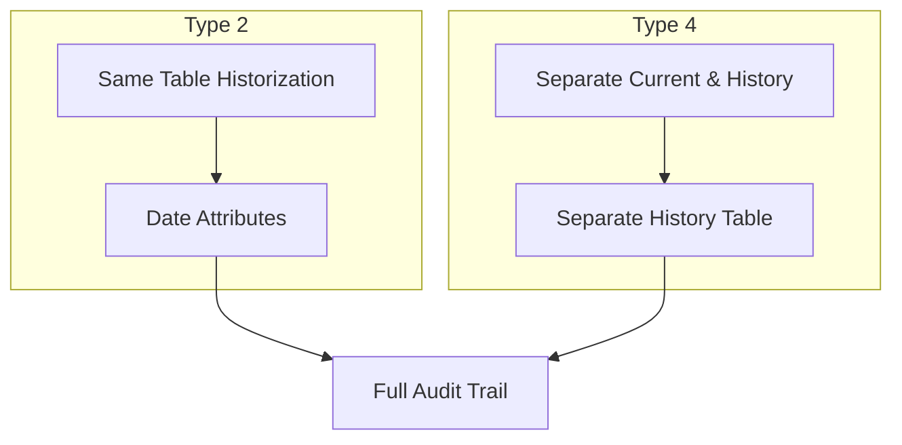

## Normalization

In the Medallion architecture, data normalization is a critical process, particularly within the Intermediate layer:

- **Intermediate Layer for Normalization**: This layer focuses on establishing conformed dimensions and normalized entities, such as customer and product data.
- **Refined Layer for Denormalization**: While the Intermediate layer maintains normalized data, the Refined layer adapts this data into denormalized models to meet specific consumer requirements, optimizing query performance.
- **Multi-model Support**: Delta Lake supports various data models, including relational, graph, and document models, allowing for the selection of the most appropriate structure based on data access patterns.

For instance, user profiles might be stored in a normalized relational format in the Intermediate layer, but in the Refined layer, they could be structured as a graph model for recommendation engines or in a columnar format for analytics.

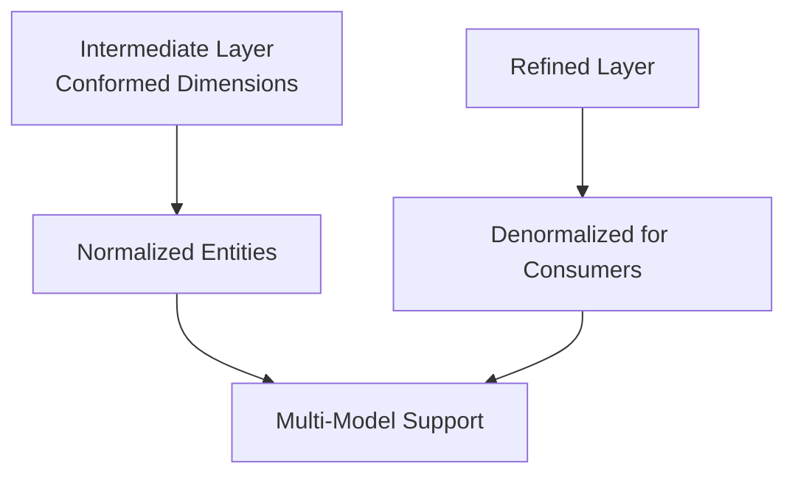

## Multi-Model Support

Delta Lake's support for multiple data models and storage formats caters to various performance and analytical needs within the Medallion architecture:

- **Relational Model**: Supports traditional relational structures and SQL for analysis, ideal for storing normalized data.
- **Graph Model**: Integrates with graph processing frameworks for connected data analysis, suitable for use cases like network analysis or recommendation systems.
- **Document Model**: Capable of handling semi-structured data like JSON, which is useful for diverse data types like clickstreams or IoT data.
- **Columnar Storage**: Optimizes analytic queries through Parquet format storage, enhancing query performance for large datasets.

This multi-model support allows Medallion to tailor data management to specific use cases while maintaining a consistent data lake through the

unified Delta Lake format. It provides the flexibility to optimize storage and access patterns based on the specific requirements of each data layer:

- In the Intermediate layer, a relational model might be employed for ease of normalization.
- The Refined layer could leverage graph or document structures to match specific downstream application needs.
- For efficient query performance, both the Initial and Intermediate layers might use columnar formats like Parquet.
- New data types, such as IoT event streams, could be ingested using a document model in JSON format.

This approach ensures that each layer of the Medallion architecture can effectively manage and utilize data according to its specific role and objectives, while maintaining overall compatibility and coherence within the Lakehouse framework.

## Historization Approaches

Historization is a key aspect of managing data evolution and history in the Medallion architecture. There are two primary techniques:

### Type 2 Historization

This method involves storing historical data within the same table by adding time-related attributes. It's optimal when:

- The volume of historical data is moderate.
- Main query patterns involve time-series analysis or tracking historical trends.
- Managing the size of the main table is feasible without splitting historical data.

For example, an "orders" table might include "start_date" and "end_date" attributes to facilitate queries for specific time periods, with new and updated rows receiving updated date ranges.

### Type 4 Historization

This approach separates current and historical data into different tables. It's more suitable when:

- The historical data volume is significant.
- Queries primarily target current data.
- Separating historical data improves performance by reducing the main table's size.

Here, the "orders" table would contain only current data, while a separate "orders_history" table would store historical snapshots. This setup necessitates a management process to periodically update the "orders_history" table with new snapshots.

The choice between Type 2 and Type 4 historization depends on data volume, query patterns, and the complexity of data reconstruction. Both methods enable the reproduction of past data states, either through date-based filtering or table joins, and are accommodated within Medallion's layered architecture to suit the needs of different datasets.

## Metadata Management

Effective metadata management is crucial in the Medallion architecture for facilitating data discovery, governance, and lineage. The architecture leverages various types of metadata:

### Technical Metadata

- Involves dataset and attribute definitions, including table and column level information like names, descriptions, data types, and relationships.
- Captured and maintained by tools like Unity Catalog, ensuring detailed tracking of data structures.

### Operational Metadata

- Pertains to data processing operations, such as job execution details, performance metrics, and processing histories.
- Essential for monitoring data pipeline health and efficiency.

### Business Metadata

- Includes business-relevant information like data ownership, usage policies, and domain-specific definitions.
- Critical for understanding the context and relevance of data within business processes.

These metadata types collectively support a comprehensive Discovery Catalog within the Lakehouse, enabling users to effectively navigate and utilize the data landscape. They also play a key role in impact analysis and governance, ensuring that data usage aligns with organizational standards and regulatory requirements.

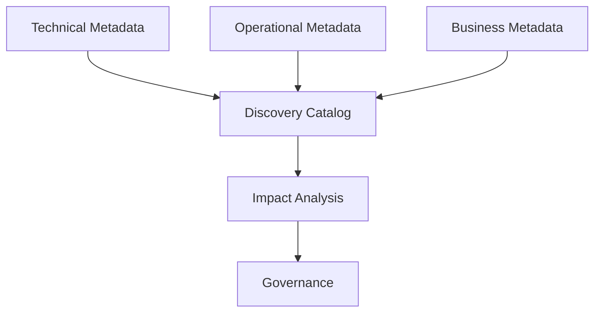

In summary, the Medallion architecture provides a sophisticated, multi-layered approach to data management within a Lakehouse environment. It emphasizes structured data processing, robust governance, and flexibility to adapt to various data models and formats, ensuring that organizations can effectively harness their data assets for a wide range of analytical and operational purposes.

## Tagging Using Ontology

Tagging using Ontology is a crucial aspect of enhancing data discoverability and management in the Medallion architecture. This process involves classifying and labeling data assets using a structured, hierarchical set of concepts (ontology), making it easier for users to find and understand data. This section fits best after the "Metadata Management" section, as it is an extension of the concept of metadata, focusing specifically on the classification and organization of data assets.

### Ontology-Based Tagging

- **Structured Tagging**: Using a predefined ontology O to tag data assets systematically. This includes categorizing data based on its type, source, content, usage, and other relevant attributes. Formally, an ontology O can be represented as O = (C, R, I), where C is a set of concepts, R is a set of relations between concepts, and I is a set of instances.

- **Semantic Relationships**: Establishing relationships between different data assets based on their tags, facilitating more intuitive data discovery and linkage. These relationships can be formally defined using description logic expressions. For example:

```
Publication ⊑ ∃publishedBy.Researcher
```

- **Hierarchical Classification**: Organizing data tags in a hierarchical manner, from general to specific, enabling users to navigate through data layers efficiently. This hierarchy can be represented mathematically as a partially ordered set (poset).

### Implementation in the Medallion Architecture

- **Across Layers**: Implementing tagging in each layer of the Medallion architecture, ensuring that data is consistently classified throughout its lifecycle. Formally, this involves defining ontology mapping functions between layers:

```
f: O1 → O2
g: O2 → O3  
```

- **Integration with Data Cataloging**: Enhancing the Discovery Catalog DC with ontology-based tagging, improving data searchability and governance. This allows semantic queries of the form:

```SPARQL
SELECT ?data
WHERE {?data dc:subject o:HealthData}
```

- **User Interface for Tag Management**: Providing an intuitive interface for data stewards and users to apply, update, and manage tags based on the ontology.


### Benefits

- **Enhanced Discoverability**: Easier for users to find relevant data quickly. This can be quantified by improved precision and recall metrics.

- **Consistency in Data Management**: Uniform classification across all data assets. This is ensured mathematically by the ontology mapping functions.

- **Improved Data Governance**: Facilitates adherence to data policies and standards. Reduces manual governance effort through automated tagging.

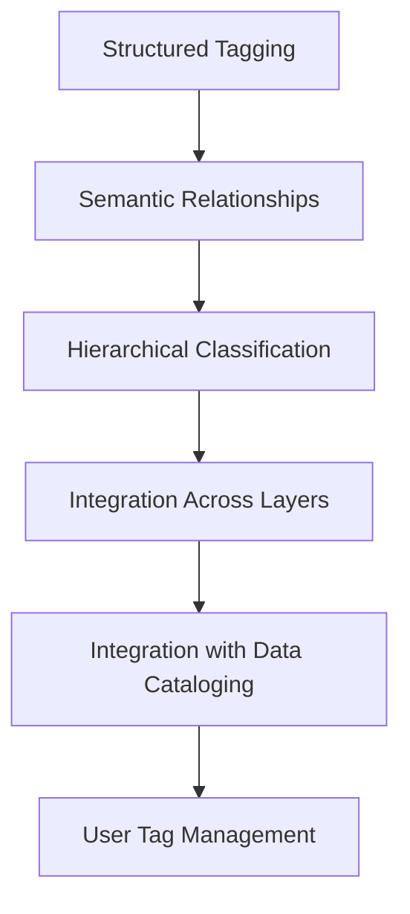

By integrating ontology-based tagging into the Medallion architecture, organizations can achieve a more organized, searchable, and governable data environment. This approach not only streamlines data management processes but also empowers users to leverage data more effectively for insights and decision-making.

### Refined Layer

The Refined layer is focused on preparing customized datasets for specific applications, users, and consumption scenarios. It involves the final transformations and application of business logic. Key features include:

- Tailored data preparation for business users
- Data sandboxes for analysts and knowledge workers
- Data masking for sensitive information protection
- Cross-system integration for siloed data
- Advanced data aggregation, roll-ups, and hypercubes
- Performance optimization through data caching
- Development of custom views and schemas for different consumer needs
- Metadata-driven automation and reusability

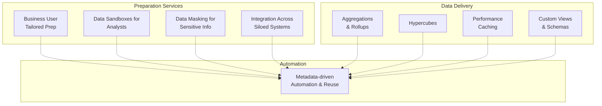

## Incremental Data Replication

- Autoloader for efficient incremental data ingestion

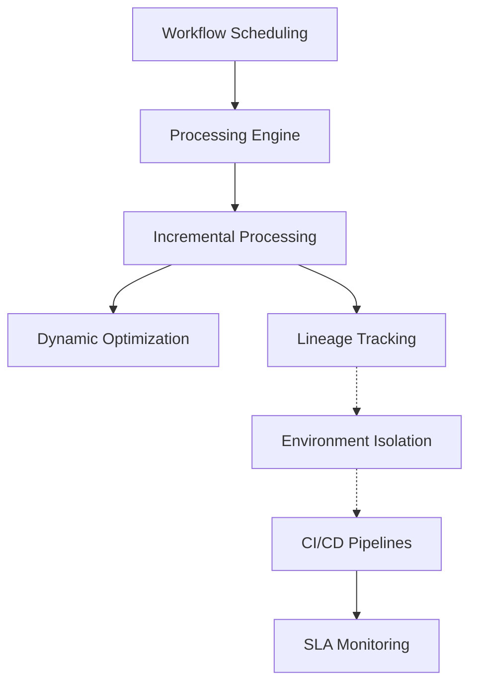

## Data Pipeline Orchestration

Orchestrating data across Medallion layers involves strategic use of workflow schedulers, distributed processing engines, and DevOps practices:

### Workflow Scheduling

- Utilization of tools like Apache Airflow or similar to define and manage data pipelines
- Isolation of environments (development, testing, production)
- Application of CI/CD principles to data management
- SLA monitoring and alert systems
- Tracking of data lineage through different stages

### Processing Engines

- Implementation of distributed processing engines like Apache Spark or Apache Flink

### Incremental Processing

Delta Lake supports efficient incremental processing with features like change data capture, snapshot management, and stream processing. This allows for the development of robust, fault-tolerant incremental ETL pipelines that scale effectively with data volume growth. The unified model for batch and streaming data processing enhances flexibility and performance.

In summary, the Medallion architecture presents a comprehensive approach to managing and leveraging data within a modern Lakehouse framework. It emphasizes structured layering, efficient data processing, robust governance, and adaptability to evolving business needs and technologies.

## Data Governance and Security

Within the Medallion architecture, data governance and security are paramount to ensure data integrity, compliance, and controlled access to data across different layers:

### Data Governance

- **Policy Management**: Implementation of comprehensive data policies, including access controls, data retention rules, and compliance with regulatory standards.
- **Data Lineage**: Tracking the flow of data through the Medallion layers to maintain transparency and auditability.
- **Data Cataloging**: Utilizing tools like Unity Catalog for metadata management, enabling users to discover and understand data assets efficiently.

### Security Measures

- **Encryption**: Ensuring data at rest and in transit is encrypted, protecting sensitive information across all layers of the architecture.
- **Authentication and Authorization**: Implementing robust identity and access management systems to control user access to data resources.
- **Data Masking and Anonymization**: Techniques used in the Refined layer to protect personal and sensitive data, while still allowing for analytical insights.

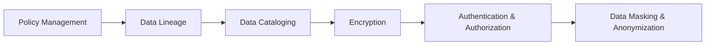

## Advanced Analytics and Machine Learning Integration

The Medallion architecture seamlessly integrates advanced analytics and machine learning capabilities, enabling organizations to leverage their data for predictive insights and intelligent decision-making:

### Machine Learning Operations (MLOps)

- **Model Development and Training**: Leveraging the Refined layer for developing and training machine learning models.
- **Model Deployment and Monitoring**: Efficient deployment of models into production with continuous monitoring for performance and accuracy.

### Analytics Workflows

- **Self-Service BI Tools**: Integration with business intelligence tools for self-service analytics, enabling users to create custom reports and dashboards.
- **Real-Time Analytics**: Leveraging streaming data capabilities for real-time insights and decision-making.

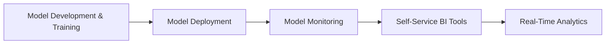

## Scalability and Performance Optimization

To handle growing data volumes and complex analytics workloads, the Medallion architecture is designed with scalability and performance in mind:

### Scalability

- **Elastic Computing Resources**: Automatic scaling of computational resources to meet workload demands, ensuring efficient data processing.
- **Distributed Data Processing**: Utilizing technologies like Spark for parallel data processing across clusters.

### Performance Optimization

- **Data Caching**: Implementing caching mechanisms in the Refined layer for faster query performance.
- **Query Optimization**: Advanced algorithms for optimizing data retrieval and processing tasks.

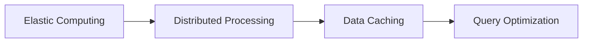

## Conclusion

The Medallion architecture offers a comprehensive, scalable, and secure framework for modern data management and analytics. By structuring data across distinct layers, it enables organizations to efficiently manage data lifecycles from raw ingestion to advanced analytics. The integration of governance, security, machine learning, and performance optimization ensures that data assets are not only well-managed but also leveraged effectively to drive business insights and innovation. This architecture is adaptable to various industry needs and scales, making it a versatile solution for organizations navigating the complex landscape of big data and analytics.