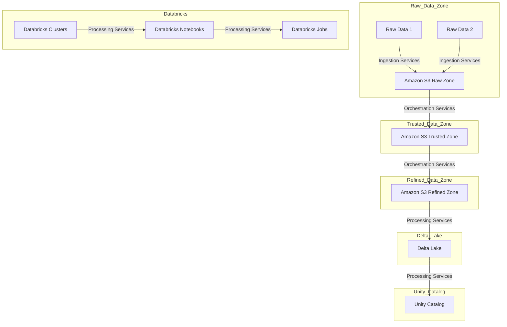
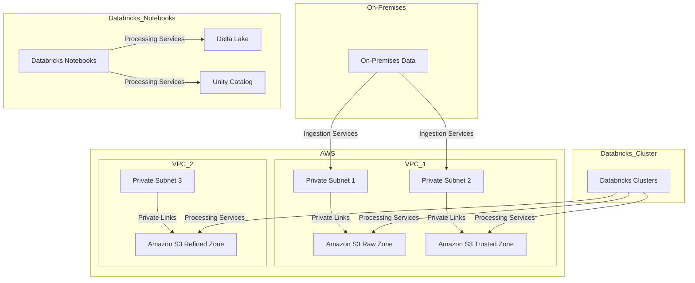

# Medallion: AWS and Databricks Integration

Medallion is a robust and integrated data architecture that leverages AWS and Databricks services to build a governed data lakehouse. It combines the strengths of both platforms to provide a comprehensive solution for data processing and analytics. Below is a complete overview of the Medallion architecture, including logical and conceptual data architecture as well as networking design.

## Logical and Conceptual Data Architecture

### Logical Data Flow
- Raw data from various sources is ingested into the Raw Data Zone using Ingestion Services, including Kinesis Streams, Kinesis Firehose, and S3 Batch Operations.
- Orchestration Services, such as AWS Step Functions and AWS EventBridge, manage the movement of data from the Raw Zone to the Trusted Zone and then to the Refined Zone in Amazon S3.
- Data processing tasks are executed on Databricks Clusters, orchestrated by Databricks Notebooks and Jobs.
- The processed data is stored in Delta Lake and cataloged in Unity Catalog for governance and discovery.

## Networking Design

### Networking Details
- Private Subnet 1 and Private Subnet 2 in VPC_1 are used to securely connect to Amazon S3 Raw and Trusted Zones, respectively, using Private Links. This ensures data privacy and security.
- Private Subnet 3 in VPC_2 connects to Amazon S3 Refined Zone via Private Links for secure data transfer.
- On-Premises Data sources connect to AWS via Ingestion Services, including Kinesis Streams, Kinesis Firehose, and S3 Batch Operations.
- Databricks Clusters securely access data in S3 Raw and Trusted Zones for processing.
- Databricks Notebooks interact with Delta Lake and Unity Catalog for data development and governance.

The Medallion architecture offers a seamless and secure data processing solution, combining the scalability of AWS and the data processing capabilities of Databricks while ensuring data privacy and governance through Private Links.