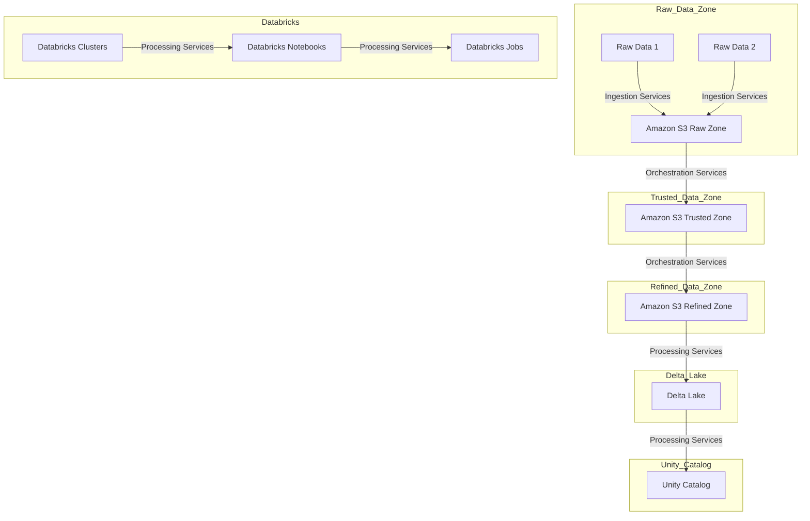
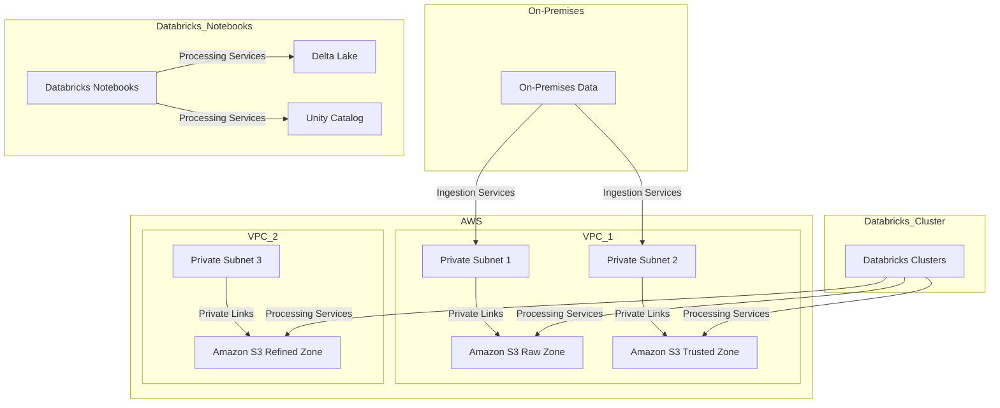
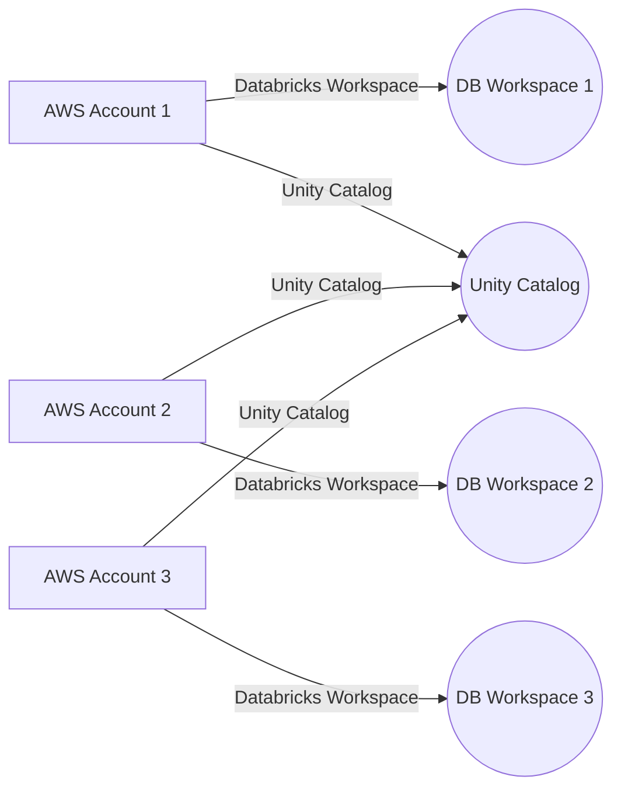
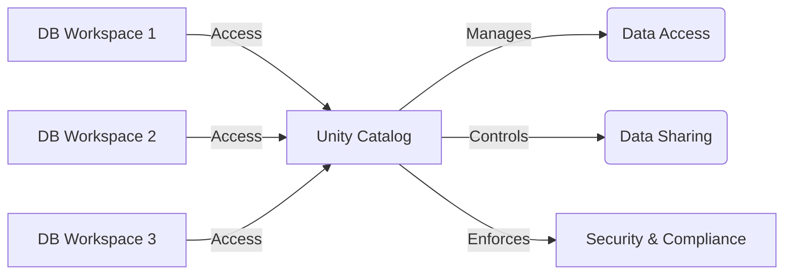
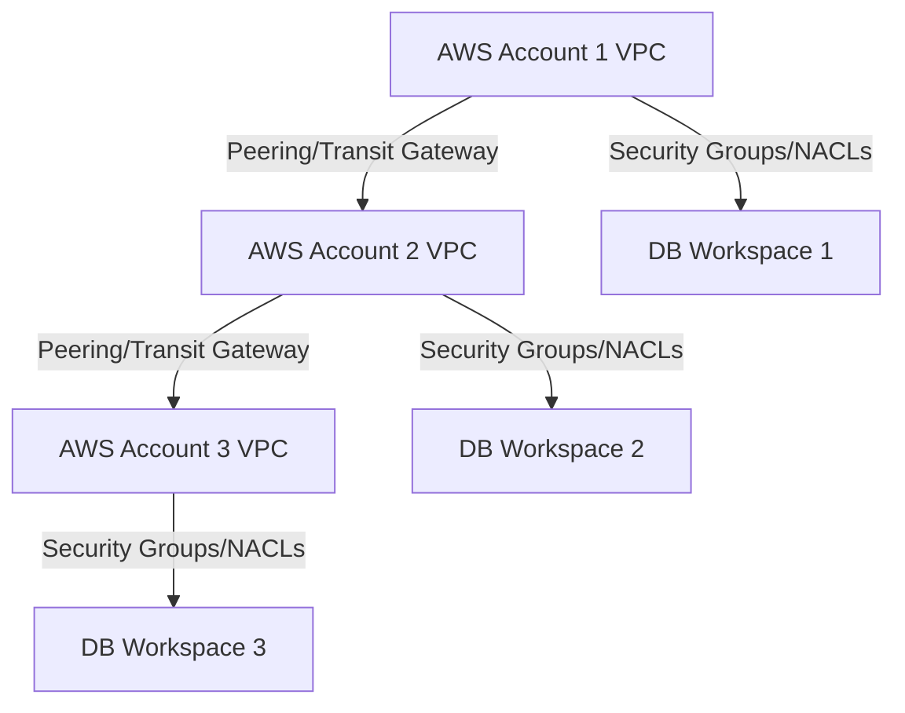
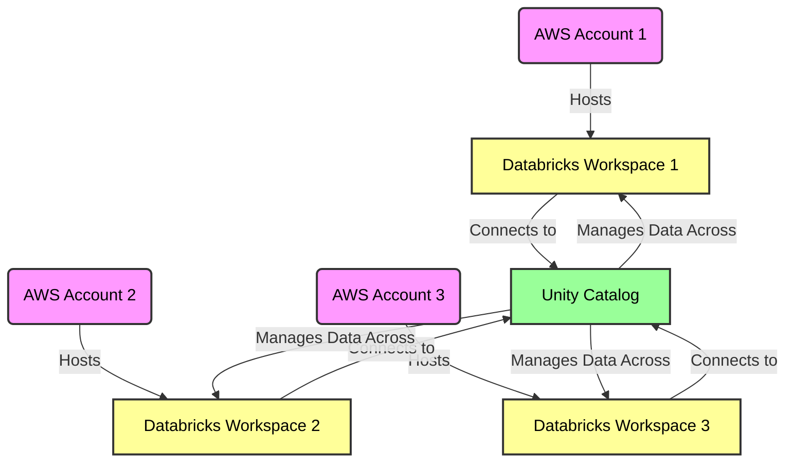
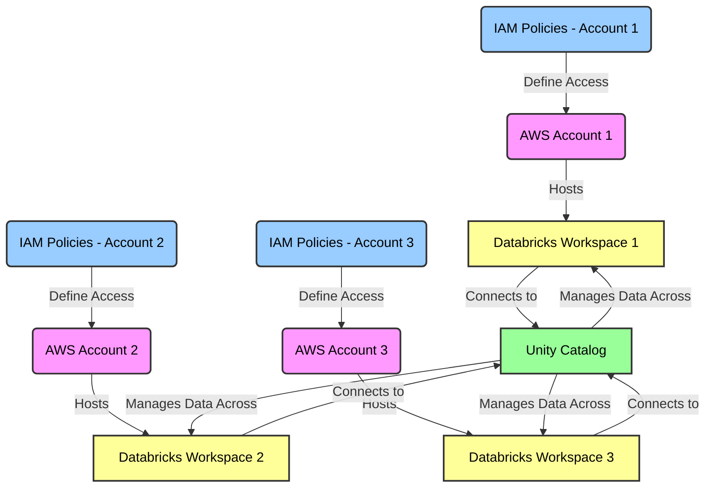
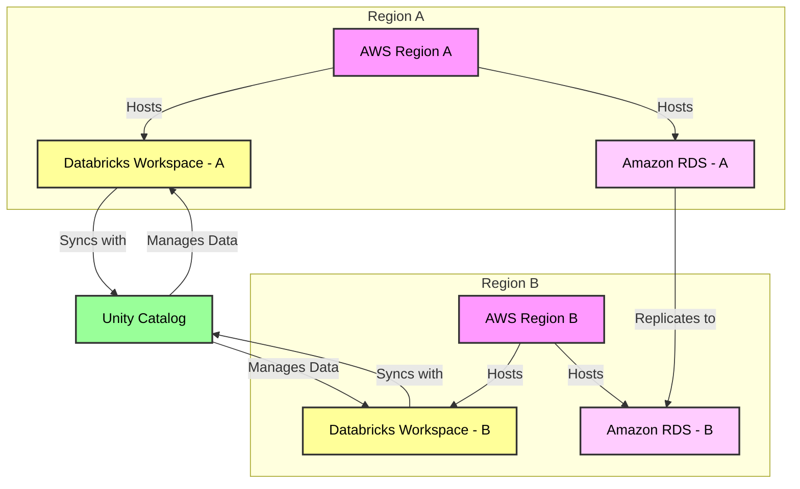

## Table of Contents

1. **[Medallion: AWS and Databricks Integration](#medallion-aws-and-databricks-integration)**
    - [Logical and Conceptual Data Architecture](#logical-and-conceptual-data-architecture)
    - [Networking Design](#networking-design)
        - [Networking Details](#networking-details)

2. **[Federated Setup](#federated-setup)**
    - [1. Logical Design](#1-logical-design)
    - [2. Conceptual Design](#2-conceptual-design)
    - [3. Network Design](#3-network-design)
    - [Additional Details](#additional-details)
    - [Implementation Steps](#implementation-steps)

3. **[Multiple IAM Policies Setup](#multiple-iam-policies-setup)**
    - [Key Components](#key-components)

4. **[AWS Multi-Region Unity Catalog and RDS Configuration](#aws-multi-region-unity-catalog-and-rds-configuration)**
    - [Key Features](#key-features)
    - [AWS Services and IAM Policy Details](#aws-services-and-iam-policy-details)

5. **[Additional Focus Areas](#additional-focus-areas)**

## Medallion: AWS and Databricks Integration

Medallion is a robust and integrated data architecture that leverages AWS and Databricks services to build a governed data lakehouse. It combines the strengths of both platforms to provide a comprehensive solution for data processing and analytics. Below is a complete overview of the Medallion architecture, including logical and conceptual data architecture as well as networking design.

## Logical and Conceptual Data Architecture

### Logical Data Flow
- Raw data from various sources is ingested into the Raw Data Zone using Ingestion Services, including Kinesis Streams, Kinesis Firehose, and S3 Batch Operations.
- Orchestration Services, such as AWS Step Functions and AWS EventBridge, manage the movement of data from the Raw Zone to the Trusted Zone and then to the Refined Zone in Amazon S3.
- Data processing tasks are executed on Databricks Clusters, orchestrated by Databricks Notebooks and Jobs.
- The processed data is stored in Delta Lake and cataloged in Unity Catalog for governance and discovery.

## Networking Design

### Networking Details
- Private Subnet 1 and Private Subnet 2 in VPC_1 are used to securely connect to Amazon S3 Raw and Trusted Zones, respectively, using Private Links. This ensures data privacy and security.
- Private Subnet 3 in VPC_2 connects to Amazon S3 Refined Zone via Private Links for secure data transfer.
- On-Premises Data sources connect to AWS via Ingestion Services, including Kinesis Streams, Kinesis Firehose, and S3 Batch Operations.
- Databricks Clusters securely access data in S3 Raw and Trusted Zones for processing.
- Databricks Notebooks interact with Delta Lake and Unity Catalog for data development and governance.

The Medallion architecture offers a seamless and secure data processing solution, combining the scalability of AWS and the data processing capabilities of Databricks while ensuring data privacy and governance through Private Links.

## Federated Setup

Creating a detailed guide for setting up a federated AWS cross-account setup using multiple Databricks workspaces, along with the implementation of Unity Catalog, involves several intricate steps. This guide will be structured into three main sections: logical design, conceptual design, and network design, with each section containing a diagram for visual representation.

### 1. Logical Design

The logical design will outline the architecture and the components involved in the setup. Key elements include:

- **Multiple AWS Accounts**: Each account hosts its own resources and Databricks workspaces.
- **Databricks Workspaces**: These are set up in each AWS account, allowing for data processing and analytics.
- **Unity Catalog**: A unified data management system that provides a consistent view of data across different Databricks workspaces.

#### Logical Design

### 2. Conceptual Design

In the conceptual design, we will focus on the data flow and management aspects:

- **Data Sharing and Access Control**: How data is shared between different Databricks workspaces and managed via Unity Catalog.
- **Security and Compliance**: Ensuring data governance and compliance across the federated setup.

### 3. Network Design

The network design will cover the connectivity and security aspects:

- **VPC Peering or Transit Gateway**: To connect different AWS accounts and their resources.
- **Security Groups and Network ACLs**: For managing network traffic and access control.

#### Network Design

### Additional Details

- **AWS IAM Roles and Policies**: Define and manage access policies for cross-account access.
- **Encryption and Data Protection**: Implement encryption both in-transit and at-rest for data security.
- **Monitoring and Logging**: Use AWS CloudWatch and Databricks monitoring tools for operational visibility.

### Implementation Steps

1. **Setup AWS Accounts**: Create and configure AWS accounts, VPCs, and IAM roles.
2. **Deploy Databricks Workspaces**: Each AWS account should have its Databricks workspace set up.
3. **Configure Unity Catalog**: Set up Unity Catalog in Databricks

### Multiple IAM Policies Setup
In a federated AWS environment with multiple Databricks workspaces, it's crucial to establish robust IAM policies to manage permissions and access control effectively. These policies determine how users, services, and applications interact with AWS resources.

### Key Components:

1. IAM Roles and Policies for Each AWS Account: Unique roles and policies should be defined in each AWS account to control access to resources, including Databricks workspaces.
2. Cross-Account Access Management: IAM roles can be set up to allow users from one AWS account to access resources in another account, which is essential for a federated environment.
3. Fine-Grained Access Control in Databricks Workspaces: Policies should also extend to managing access within Databricks, controlling which users can access specific datasets, notebooks, and other resources.
4. Integration with Unity Catalog: IAM policies should align with the Unity Catalog's governance model to manage data access across different workspaces consistently.

### AWS Multi-Region Unity Catalog and RDS Configuration

Deploying a multi-region Unity Catalog on AWS with integrated Amazon RDS aims to enhance data management, ensure high availability, and maintain compliance with diverse regional regulations.

#### Key Features:

1. **Cross-Regional Data Replication**: Implementing robust data replication strategies across AWS regions to support high availability and disaster recovery.

2. **Centralized Governance with Unity Catalog**: Unity Catalog centralizes data governance, ensuring uniform data access and management across multiple regions.

3. **Regulatory Compliance Across Regions**: Aligning data storage and processing with the regional legal requirements to ensure compliance.

#### AWS Multi-Region Architecture

### AWS Services and IAM Policy Details

| AWS Service | Description | IAM Policy Details |
|-------------|-------------|--------------------|
| Databricks Workspaces | Operated in multiple AWS regions for distributed data processing. | Policies should grant access to regional AWS resources such as S3 buckets and EC2 instances. |
| Amazon RDS | A relational database service available in various regions for data handling. | Policies should control access to RDS instances, manage data replication, and facilitate cross-region connectivity. |
| Unity Catalog | Provides centralized data governance across AWS regions. | Policies should manage access to datasets, tables, and regulate data sharing across regions. |
| S3 (Simple Storage Service) | Used for data storage and inter-regional replication. | Policies should permit read/write access to designated S3 buckets, including rights for cross-region replication. |
| Route 53 | Manages DNS and traffic routing across AWS regions. | Policies should oversee DNS configurations and traffic management for effective regional routing. |
| AWS KMS (Key Management Service) | Central to securing data via encryption keys. | Policies should enable the creation, management, and cross-regional use of encryption keys for data security. |

The table now presents the information in a clear and structured format, detailing AWS services and their corresponding IAM policy requirements for a multi-region Unity Catalog and RDS setup.

### Additional Focus Areas**

- **Secure Inter-Region Connectivity**: Ensuring robust and secure data transfer across various AWS regions, enhancing the overall system resilience.
- **Comprehensive Monitoring**: Implementing tools like AWS CloudWatch for real-time monitoring and operational oversight across all regions.
- **Disaster Recovery Strategies**: Formulating and implementing robust data backup and recovery plans suited for a multi-region setup.

This comprehensive setup, illustrated with the design diagram and detailed in the table, outlines a multi-region Unity Catalog configuration on AWS, incorporating Amazon RDS for sophisticated data handling. It emphasizes a harmonious blend of data management, security, and compliance across different geographical regions. The IAM policy details are meticulously crafted to match the unique requirements of each service in a diverse, multi-region AWS environment.