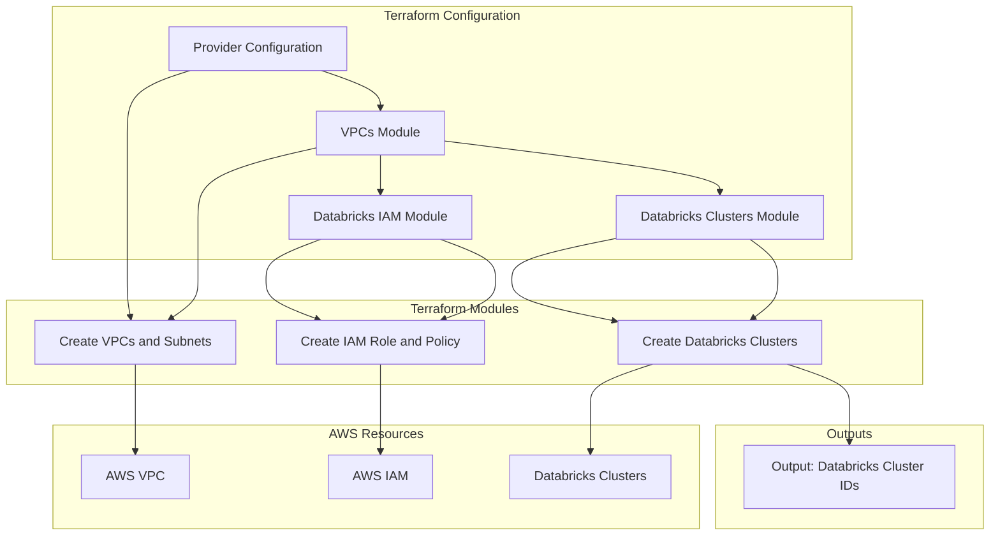
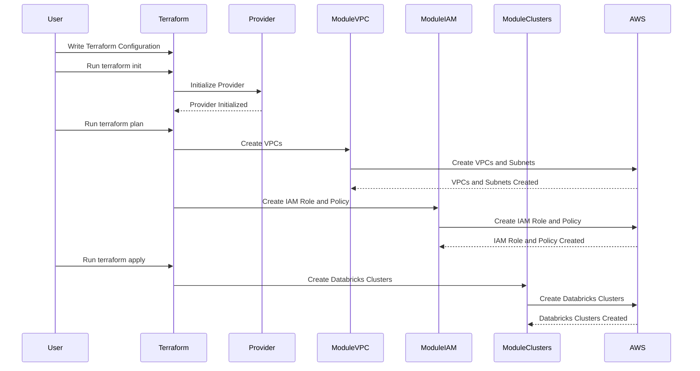

## Terraform Explanation

Terraform is an Infrastructure as Code (IaC) tool that allows you to define and provision infrastructure resources in a declarative manner. In the context of the provided Terraform script, let's break down how it works:

1. **Provider Configuration**: In the script, the first block configures the AWS provider using `provider "aws"`. This tells Terraform that it should interact with AWS services, and it specifies the AWS region to operate in.

2. **Modularization**: The script utilizes Terraform modules to organize and modularize the code. Three main modules are used:

    - **VPCs Module**: This module defined by `module "vpcs"` creates Virtual Private Clouds (VPCs) and associated subnets. It uses the specified CIDR blocks for VPCs and subnets.

    - **Databricks IAM Module**: The `module "databricks_iam"` creates an IAM role for Databricks, allowing it to access AWS resources securely.

    - **Databricks Clusters Module**: The `module "databricks_clusters"` creates Databricks clusters for data processing. It specifies the number of clusters, subnet IDs, and the IAM role ARN.

3. **Resource Blocks**: Within each module, Terraform defines AWS resources such as VPCs, subnets, IAM roles, and Databricks clusters. These resource blocks specify the configuration of the desired infrastructure.

4. **Outputs**: The script defines output values like `output "databricks_cluster_ids"` to provide information about the created infrastructure, which can be useful for reference or integration with other tools.

## Detailed Design

Here's a Mermaid diagram illustrating the high-level structure of the provided Terraform script:

In the Mermaid diagram:

- The "Terraform Configuration" section represents the main Terraform script, defining providers and modules.
- The "Terraform Modules" section shows the modules used in the script: VPCs Module, Databricks IAM Module, and Databricks Clusters Module.
- The "AWS Resources" section represents the AWS resources created by each module.
- The "Outputs" section indicates the output values defined in the script.

## Sequence Diagram

Here's a simplified sequence diagram depicting the workflow of Terraform commands and how they interact with the modules and AWS resources:

In the sequence diagram:

- The "User" initiates the process by writing Terraform configuration, running `terraform init`, and `terraform plan`.
- "Terraform" orchestrates the execution of commands and interacts with the specified AWS provider.
- The modules (`ModuleVPC`, `ModuleIAM`, `ModuleClusters`) define and create AWS resources in response to Terraform commands.
- "AWS" represents the actual AWS resources being created.

This sequence illustrates how Terraform commands trigger the creation of AWS resources through modularized modules, aligning with the Terraform script provided in the context of the Medallion architecture.

Here is a table comparing Terraform (TF) with the name of the component/module and a brief description:

| Terraform Component | Name                   | Description                                   |
|---------------------|------------------------|-----------------------------------------------|
| `provider "aws"`   | AWS Provider           | Defines the AWS region and authentication.   |
| `module "vpcs"`    | VPCs Module            | Creates VPCs, subnets, and private subnets.  |
| `module "databricks_iam"` | IAM Roles Module | Sets up IAM roles and policies for Databricks. |
| `module "databricks_clusters"` | Databricks Clusters Module | Creates Databricks clusters for data processing. |
| `resource "aws_vpc" "vpc1"` | VPC 1 | Defines the first Virtual Private Cloud (VPC). |
| `resource "aws_vpc" "vpc2"` | VPC 2 | Defines the second Virtual Private Cloud (VPC). |
| `resource "aws_subnet" "private_subnet1"` | Private Subnet 1 | Creates private subnets in VPC 1. |
| `resource "aws_subnet" "private_subnet3"` | Private Subnet 3 | Creates a private subnet in VPC 2. |
| `resource "aws_iam_role" "databricks_role"` | Databricks IAM Role | Defines the IAM role for Databricks. |
| `resource "aws_iam_policy" "s3_access_policy"` | S3 Access Policy | Specifies IAM policy for S3 bucket access. |
| `resource "aws_iam_policy_attachment" "databricks_policy_attachment"` | IAM Policy Attachment | Attaches the IAM policy to the Databricks role. |
| `resource "databricks_cluster" "medallion_clusters"` | Databricks Clusters | Creates Databricks clusters for data processing. |
| `output "databricks_cluster_ids"` | Databricks Cluster IDs | Outputs the IDs of the Databricks clusters. |
| `output "private_subnet_ids"` | Private Subnet IDs | Outputs the IDs of the private subnets. |
| `output "databricks_role_arn"` | Databricks Role ARN | Outputs the ARN of the Databricks IAM role. |

This table provides an overview of the Terraform components, their names, and brief descriptions within the architecture and modularized structure discussed earlier. It helps clarify the purpose of each component/module in the Terraform script.